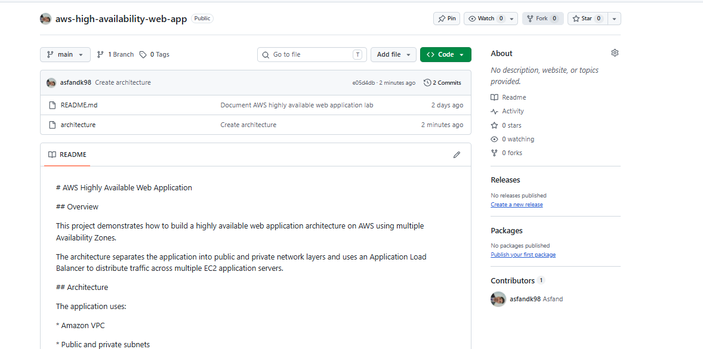

# AWS Highly Available Web Application

A hands-on AWS project demonstrating how to build, configure, secure, and validate a highly available web application architecture across multiple Availability Zones.

The project uses Amazon VPC, public and private subnets, Internet Gateway, NAT Gateway, Security Groups, Network ACLs, an Application Load Balancer, private EC2 instances, Nginx, Route 53 Private Hosted Zones, IAM roles, health checks, load balancing, and recovery testing.

---

## Overview

This project demonstrates the deployment of a highly available web application on AWS using a multi-Availability Zone architecture.

The application separates internet-facing infrastructure from the application layer.

An internet-facing Application Load Balancer receives HTTP traffic and distributes requests between two EC2 application servers located in private subnets across two Availability Zones.

### Availability Zones

```text
us-east-1a
us-east-1b

The architecture is designed so that the application does not depend on a single EC2 instance or a single Availability Zone.

Architecture

The application follows this architecture:

Architecture Flow

The primary application traffic flow is:

Internet
   |
   v
Internet Gateway
   |
   v
Application Load Balancer
   |
   +-------------------+
   |                   |
   v                   v
EC2 App Server 1   EC2 App Server 2
us-east-1a         us-east-1b
Private Subnet     Private Subnet
Nginx :80          Nginx :80

The EC2 application servers are located in private subnets and are accessed through the Application Load Balancer.

AWS Services Used
AWS Service	Purpose
Amazon VPC	Provides the isolated network environment
Public Subnets	Hosts internet-facing infrastructure
Private Subnets	Hosts application servers
Internet Gateway	Provides internet connectivity for public resources
NAT Gateway	Provides outbound internet access from private subnets
Route Tables	Controls network traffic routing
Security Groups	Controls resource-level traffic
Network ACLs	Provides subnet-level traffic filtering
Application Load Balancer	Distributes HTTP traffic
Target Group	Registers EC2 application servers
EC2	Runs the web application
Amazon Linux	Operating system for EC2
Nginx	Web server
Route 53	Provides private DNS
IAM Role	Provides AWS permissions to EC2
Health Checks	Verifies application server availability
VPC Network Design

The VPC uses the following CIDR:

10.0.0.0/16

The network is divided into public, private application, and private database subnets.

Public Subnets
10.0.1.0/24   us-east-1a
10.0.3.0/24   us-east-1b

Public subnets are used for internet-facing infrastructure.

The Application Load Balancer is deployed in the public subnet layer.

NAT Gateways are also placed in public subnets.

Private Application Subnets
10.0.11.0/24   us-east-1a
10.0.13.0/24   us-east-1b

These subnets contain the EC2 application servers.

The application servers are not intended to be directly exposed to the internet.

Private Database Subnets
10.0.21.0/24   us-east-1a
10.0.22.0/24   us-east-1b

These subnets are reserved for a future database layer.

A future implementation could deploy Amazon RDS with Multi-AZ capabilities.

VPC Configuration

The VPC and subnet configuration was created to support the multi-AZ application architecture.

EC2 Application Servers

Two EC2 application servers were deployed across separate Availability Zones.

EC2 Application Server 1
Availability Zone: us-east-1a
Private Subnet:    10.0.11.0/24
EC2 Application Server 2
Availability Zone: us-east-1b
Private Subnet:    10.0.13.0/24

Both servers run:

Amazon Linux
Nginx
HTTP :80

Each server returns a different response so that load balancing can be verified.

Server 1 Response
Hello from APP SERVER 1

EC2-1 | Private Subnet | us-east-1a
Server 2 Response
Hello from APP SERVER 2

EC2-2 | Private Subnet | us-east-1b
Private EC2 Networking

The EC2 instances are deployed in private application subnets.

The application servers do not require public IP addresses for normal application traffic.

Traffic from the internet reaches the EC2 instances through the Application Load Balancer.

NAT Gateway

NAT Gateways provide outbound internet connectivity for resources located in private subnets.

The private EC2 instances can use NAT Gateway connectivity when they need to access external resources.

The intended outbound flow is:

Private EC2
     |
     v
NAT Gateway
     |
     v
Internet Gateway
     |
     v
Internet

NAT Gateway does not provide unsolicited inbound internet access to the private EC2 instances.

Application Load Balancer

An internet-facing Application Load Balancer was created to distribute HTTP traffic across the application servers.

Load Balancer Name
aws-learning-alb
Listener
HTTP :80

The Application Load Balancer is deployed across multiple Availability Zones.

Target Group

The Application Load Balancer forwards requests to the following target group:

aws-learning-app-tg

The two EC2 instances are registered as targets.

Target Health
2 Healthy
0 Unhealthy

Both application servers successfully passed the configured health checks.

Application Load Balancer Traffic Flow

The complete application request flow is:

                         INTERNET
                            |
                            v
                  +-------------------+
                  | Internet Gateway  |
                  +---------+---------+
                            |
                            v
                  +-------------------+
                  | Application Load  |
                  |    Balancer       |
                  +---------+---------+
                            |
                 +----------+----------+
                 |                     |
                 v                     v
        +----------------+    +----------------+
        | EC2 App Server |    | EC2 App Server |
        |      #1        |    |      #2        |
        |   us-east-1a   |    |   us-east-1b   |
        |    Private     |    |    Private     |
        |   Nginx :80    |    |   Nginx :80    |
        +----------------+    +----------------+
Route 53 Private DNS

A Route 53 Private Hosted Zone was created:

aws-learning.internal

A DNS record was configured:

app.aws-learning.internal

The DNS record points to the Application Load Balancer.

Private Hosted Zone

DNS Record

DNS Resolution

The application can be accessed internally using:

http://app.aws-learning.internal

DNS resolution was tested from inside the VPC and successfully returned the Application Load Balancer addresses.

Security Model

The EC2 application servers are not intended to be directly accessible from the internet.

The preferred architecture is:

Internet
   |
   v
Application Load Balancer
   |
   v
Private EC2

Instead of:

Internet
   |
   v
Public EC2

This separates the internet-facing load-balancing layer from the application layer.

Security Groups

The application security group allows HTTP traffic on port 80 from the Application Load Balancer security group.

The EC2 instances do not need unrestricted inbound HTTP access from the internet.

Conceptually:

ALB Security Group
        |
        | HTTP :80
        v
EC2 Application Security Group

This limits direct access to the application servers.

Network ACLs

Network ACLs provide an additional subnet-level security layer.

They can control inbound and outbound traffic at the subnet boundary.

The architecture therefore uses multiple layers of network security:

Internet
   |
   v
Internet Gateway
   |
   v
ALB Security Group
   |
   v
Application Security Group
   |
   v
Network ACL
   |
   v
Private EC2
IAM

An IAM role was associated with the EC2 instances.

The IAM role allows the instances to obtain AWS permissions without storing long-term AWS access keys directly on the servers.

Using IAM roles is preferred over embedding permanent AWS credentials in application servers.

Nginx

Nginx was installed on both EC2 application servers.

The web server listens on:

HTTP :80

Each server provides a unique response so that traffic distribution can be identified during testing.

Load Balancing Test

The application was tested repeatedly to verify that the Application Load Balancer distributes traffic between both EC2 instances.

The following command was used:

for i in {1..20}; do
    curl -s http://app.aws-learning.internal | grep -E "Hello from|EC2-"
    echo "----------------"
done

The responses successfully came from both application servers.

Example:

Hello from APP SERVER 1
EC2-1 | Private Subnet | us-east-1a
----------------
Hello from APP SERVER 2
EC2-2 | Private Subnet | us-east-1b
----------------
Hello from APP SERVER 1
EC2-1 | Private Subnet | us-east-1a
----------------
Hello from APP SERVER 2
EC2-2 | Private Subnet | us-east-1b
----------------

This confirms that the Application Load Balancer is distributing requests between the healthy targets.

High Availability

The application is distributed across two Availability Zones:

Availability Zone 1
us-east-1a
      |
      v
Private Application Subnet
      |
      v
EC2 App Server 1


Availability Zone 2
us-east-1b
      |
      v
Private Application Subnet
      |
      v
EC2 App Server 2

The Application Load Balancer distributes traffic between the two application servers.

This provides redundancy at the application-server level.

If one application server becomes unhealthy, the ALB health checks can detect the failure and stop routing traffic to the unhealthy target.

Recovery Testing

A recovery test was performed to validate the behavior of the highly available application architecture.

The purpose of the test was to verify that the load balancer and application environment can respond appropriately when an application target becomes unavailable and subsequently recovers.

The recovery testing provides additional validation of the high-availability design.

Troubleshooting Approach

AWS networking problems can be isolated by testing each layer independently.

The troubleshooting flow used during this project was:

DNS
 |
 v
Route 53
 |
 v
Application Load Balancer
 |
 v
Target Group
 |
 v
Security Group
 |
 v
Network ACL
 |
 v
Route Table
 |
 v
EC2
 |
 v
Nginx
 |
 v
Application

This layered troubleshooting approach makes it easier to identify where a connectivity problem exists.

DNS Troubleshooting

If DNS does not resolve, verify:

Route 53 Private Hosted Zone
        |
        v
DNS Record
        |
        v
VPC Association
        |
        v
DNS Resolution

The internal hostname used by the application is:

app.aws-learning.internal
Load Balancer Troubleshooting

If the ALB does not return the expected application response, check:

ALB Status
     |
     v
Listener
     |
     v
Listener Port
     |
     v
Target Group
     |
     v
Target Health
     |
     v
EC2 Application
EC2 Connectivity Troubleshooting

If the ALB cannot reach the EC2 instances, check:

Security Group
      |
      v
Network ACL
      |
      v
Route Table
      |
      v
Subnet
      |
      v
EC2
      |
      v
Nginx
Validation

The final architecture successfully demonstrated:

VPC configuration
CIDR addressing
Public subnets
Private application subnets
Private database subnet design
Multiple Availability Zones
Internet Gateway
NAT Gateway
Route tables
Security Groups
Network ACLs
IAM roles
Private EC2 instances
Amazon Linux
Nginx
Application Load Balancer
Target Group
Target health checks
Route 53 Private Hosted Zone
Private DNS resolution
HTTP connectivity
Load balancing
Application recovery testing
Key AWS Concepts Demonstrated
Amazon VPC
CIDR addressing
Public subnets
Private subnets
Availability Zones
Internet Gateway
NAT Gateway
Route tables
Security Groups
Network ACLs
IAM roles
EC2
Amazon Linux
Nginx
Application Load Balancer
Target Groups
Health Checks
Route 53
Private Hosted Zones
DNS resolution
High availability
Load balancing
Network troubleshooting
Application recovery
Project Screenshots

The project contains AWS console screenshots documenting the infrastructure and testing process.

Screenshot	Description
vpc.png	VPC and network configuration
private-ec2-networking.png	Private EC2 networking
nat-gateway.png	NAT Gateway configuration
application-load-balancer.png	Application Load Balancer
target-group-2-healthy.png	Target group with two healthy instances
route53-hosted-zone.png	Route 53 Private Hosted Zone
route53-record.png	Route 53 DNS record
load-balancer-test.png	Load-balancing validation
recovery-test.png	Application recovery testing
Project Structure
aws-high-availability-web-app/
│
├── README.md
│
├── architecture/
│
└── screenshots/
    ├── vpc.png
    ├── private-ec2-networking.png
    ├── nat-gateway.png
    ├── application-load-balancer.png
    ├── target-group-2-healthy.png
    ├── route53-hosted-zone.png
    ├── route53-record.png
    ├── load-balancer-test.png
    └── recovery-test.png
Future Improvements

The current architecture provides a foundation for a more production-ready AWS environment.

Potential improvements include:

HTTPS

Implement HTTPS using:

AWS Certificate Manager
HTTPS listener on the Application Load Balancer
HTTP to HTTPS redirection
Auto Scaling

Replace the manually deployed EC2 instances with an Auto Scaling Group.

This would allow EC2 instances to be automatically launched or terminated based on:

CPU utilization
Application demand
Instance health
Scaling policies
CloudWatch

Add Amazon CloudWatch monitoring for:

EC2 metrics
ALB metrics
CPU utilization
Target health
Application logs
Alarms
Systems Manager

Use AWS Systems Manager Session Manager for secure server administration without requiring direct SSH access or a public bastion host.

RDS Multi-AZ

Deploy Amazon RDS using the reserved private database subnets.

A Multi-AZ database architecture would provide additional database redundancy.

AWS WAF

Add AWS WAF to protect the application from common web-based attacks.

CloudFront

Add Amazon CloudFront for:

Content delivery
Caching
Reduced latency
Edge-level protection
Infrastructure as Code

Convert the infrastructure into code using:

Terraform
AWS CloudFormation
CI/CD

Create an automated deployment pipeline using:

GitHub
GitHub Actions
AWS CodePipeline
AWS CodeBuild
Automated Recovery

Implement automated health checks and recovery mechanisms for improved resilience.

Lessons Learned

This project demonstrated that AWS networking should be approached layer by layer.

When troubleshooting connectivity, it is important to verify:

DNS
 ↓
Load Balancer
 ↓
Target Group
 ↓
Security Group
 ↓
Network ACL
 ↓
Route Table
 ↓
EC2
 ↓
Application

Testing each layer independently makes it easier to identify configuration problems and understand how the AWS networking components interact.

The project also demonstrated the importance of:

Separating public and private infrastructure
Deploying application servers across Availability Zones
Using health checks
Restricting security-group access
Using private DNS
Testing network connectivity independently
Validating both normal operation and recovery behavior
Conclusion

This project successfully demonstrates a highly available AWS web application architecture deployed across multiple Availability Zones.

The final environment includes:

Amazon VPC
Public and private subnets
Multiple Availability Zones
Internet Gateway
NAT Gateway
Route tables
Security Groups
Network ACLs
Application Load Balancer
Target Group
Two private EC2 application servers
Amazon Linux
Nginx
Route 53 Private Hosted Zone
IAM role-based access
ALB health checks
Load-balancing validation
Recovery testing

The architecture provides a strong foundation for a production-style AWS application and can be further improved with Auto Scaling, HTTPS, CloudWatch, RDS Multi-AZ, WAF, CloudFront, Infrastructure as Code, and CI/CD.

Skills Demonstrated

AWS Networking · VPC · EC2 · ALB · Target Groups · Route 53 · NAT Gateway · Internet Gateway · Security Groups · Network ACLs · IAM · Nginx · DNS · Linux · High Availability · Load Balancing · Troubleshooting


### One important change

This version **does not use**:

```markdown
