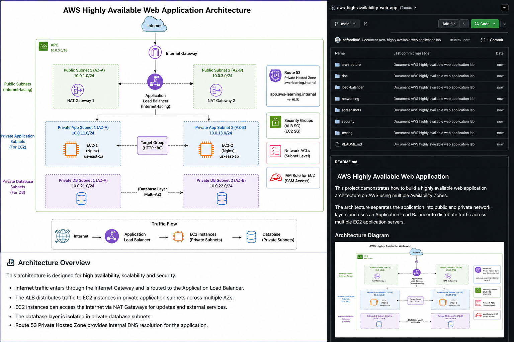

# AWS Highly Available Web Application

A hands-on AWS networking and high-availability project demonstrating a resilient web application across multiple Availability Zones using a custom VPC, public/private subnets, an Application Load Balancer, private EC2 instances, NAT Gateway, Route 53 private DNS, security groups, and health checks.

## Architecture



### Traffic Flow

```text
Internet
   |
   v
Application Load Balancer
   |
   +--------------------+
   |                    |
   v                    v
EC2 App Server 1     EC2 App Server 2
Private Subnet       Private Subnet
us-east-1a           us-east-1b
   |                    |
   +---------+----------+
             |
        NAT Gateway
             |
         Internet
```

## AWS Services Used

- Amazon VPC
- Public and private subnets
- Internet Gateway
- NAT Gateway
- Route tables
- Network ACL
- Security Groups
- Amazon EC2
- Application Load Balancer (ALB)
- Target Groups
- Route 53 Private Hosted Zone
- IAM role for EC2
- CloudWatch / AWS monitoring
- AWS Budgets

## Network Design

**VPC CIDR:** `10.0.0.0/16`

| Subnet | CIDR | Availability Zone | Purpose |
|---|---|---|---|
| Public AZ1 | `10.0.1.0/24` | us-east-1a | Public infrastructure |
| Public AZ2 | `10.0.3.0/24` | us-east-1b | Public infrastructure |
| Private App AZ1 | `10.0.11.0/24` | us-east-1a | Application server |
| Private App AZ2 | `10.0.13.0/24` | us-east-1b | Application server |
| Private DB AZ1 | `10.0.21.0/24` | us-east-1a | Database tier |
| Private DB AZ2 | `10.0.22.0/24` | us-east-1b | Database tier |

## Application Tier

Two EC2 instances run the web application:

- **EC2-1:** Private subnet, `us-east-1a`
- **EC2-2:** Private subnet, `us-east-1b`

The application servers are not directly exposed to the internet. Traffic reaches them through the Application Load Balancer.

## Load Balancing

Target group: `aws-learning-app-tg`

- Target type: Instance
- Protocol: HTTP
- Port: 80
- Protocol version: HTTP/1
- Healthy targets: **2**
- Unhealthy targets: **0**

Repeated requests returned responses from both application servers, demonstrating ALB traffic distribution.

Example:

```text
Hello from APP SERVER 1
EC2-1 | Private Subnet | us-east-1a
```

and:

```text
Hello from APP SERVER 2
EC2-2 | Private Subnet | us-east-1b
```

## Route 53 Private DNS

Private hosted zone:

`aws-learning.internal`

Private record:

`app.aws-learning.internal`

The record is configured as an A/ALIAS record pointing to the Application Load Balancer.

Tests:

```bash
nslookup app.aws-learning.internal
curl http://app.aws-learning.internal
```

## Security

The application security group allows HTTP port 80 from the ALB security group.

```text
Internet
   |
   v
ALB Security Group
   |
   v
Application Security Group
   |
   v
Private EC2 Instances
```

This prevents direct internet access to the application instances while allowing the ALB to reach them.

## NAT Gateway

Private application subnets use a NAT Gateway for outbound internet connectivity.

```text
Private EC2
    |
    v
Private Route Table
    |
    v
NAT Gateway
    |
    v
Internet Gateway
    |
    v
Internet
```

## High Availability

The application tier is distributed across two Availability Zones:

```text
             Application Load Balancer
                    /        \
                   /          \
                  v            v
             EC2-1          EC2-2
            us-east-1a     us-east-1b
```

If one application instance becomes unhealthy, the ALB can stop sending traffic to that target while continuing to serve the healthy target.

## Testing Performed

### Direct private connectivity

```bash
curl http://10.0.13.164
```

### Route 53 private DNS

```bash
nslookup app.aws-learning.internal
curl http://app.aws-learning.internal
```

### Load balancing

Repeated requests demonstrated responses from both EC2-1 and EC2-2.

### Target health

```text
2 Total Targets
2 Healthy
0 Unhealthy
```

### Failure and recovery

An application instance was stopped/unhealthy during testing and target health behavior was observed. After recovery, the target returned to a healthy state.

## Repository Structure

```text
aws-high-availability-web-app/
│
├── README.md
│
├── architecture/
│   └── aws-architecture-diagram.png
│
└── screenshots/
    ├── application-load-balancer.png
    ├── load-balancer-test.png
    ├── nat-gateway.png
    ├── private-ec2-networking.png
    ├── recovery-test.png
    ├── route53-hosted-zone.png
    ├── route53-record.png
    ├── target-group-2-healthy.png
    └── vpc.png
```

## Evidence

The `screenshots/` directory contains implementation evidence for:

- VPC configuration
- Public/private subnets
- NAT Gateway
- Route tables
- Security groups
- Application Load Balancer
- Target group health
- Route 53 hosted zone
- Route 53 DNS record
- Load-balancer testing
- Instance recovery testing

## Key Lessons

1. Designing a custom AWS VPC.
2. Understanding public vs private subnets.
3. Understanding route tables and traffic flow.
4. Using NAT Gateway for private outbound access.
5. Configuring an Application Load Balancer.
6. Understanding target health checks.
7. Restricting application access through security groups.
8. Using Route 53 private DNS.
9. Designing across multiple Availability Zones.
10. Testing failure and recovery.
11. Documenting cloud infrastructure professionally with GitHub.

## Cost Awareness

AWS Budgets was configured to monitor spending during the lab.

Because this is a learning environment, AWS resources should be reviewed and deleted when no longer required to avoid unnecessary charges.

## Project Outcome

The final environment demonstrates a highly available two-instance web application architecture in AWS.

Traffic flows through the Application Load Balancer to healthy EC2 instances in private subnets across two Availability Zones, while Route 53 provides internal DNS resolution and the NAT Gateway provides controlled outbound internet connectivity.

## Author

**Asfand**

GitHub: https://github.com/asfandk98

Repository: https://github.com/asfandk98/aws-high-availability-web-app
